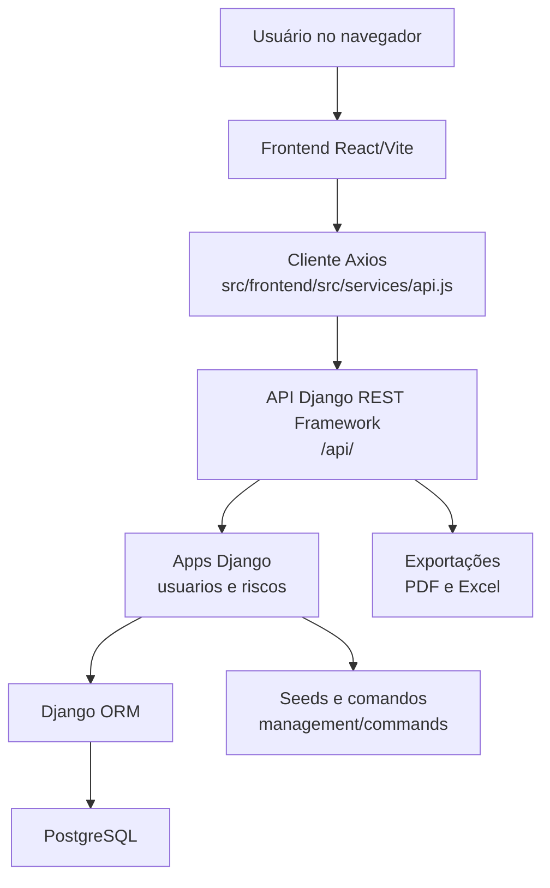
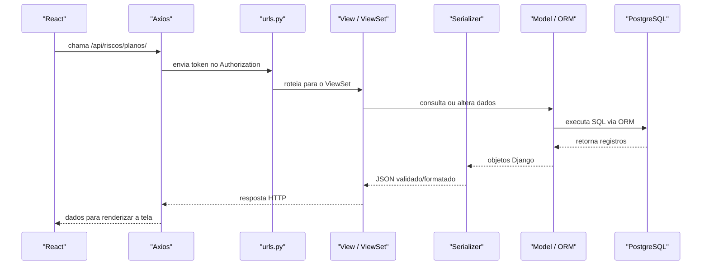
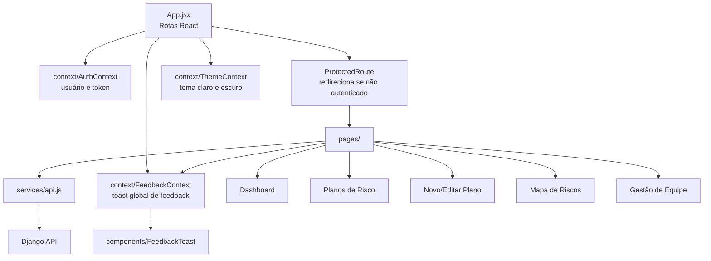

# Arquitetura do projeto

Esta página explica como o projeto **Gestão de Risco UFSM** está organizado e como as partes do sistema conversam entre si. A ideia é servir como um mapa para quem precisa entender, manter ou evoluir a aplicação.

## Visão geral

O sistema usa uma arquitetura web separada em três partes principais:

- **Frontend React/Vite**: interface usada pelos gestores para login, dashboard, planos de risco, mapa de riscos, perfil e gestão de equipe.
- **Backend Django REST Framework**: API responsável por autenticação, regras de negócio, permissões, exportações, seeds e persistência.
- **Banco PostgreSQL**: armazena usuários, setores, dados do PDI, riscos, planos de ação e monitoramentos.



## Organização de pastas

```text
src/
|-- gestao_risco/
|   |-- settings.py
|   |-- urls.py
|   |-- asgi.py
|   `-- wsgi.py
|-- usuarios/
|   |-- models.py
|   |-- serializers.py
|   |-- views.py
|   |-- urls.py
|   |-- management/commands/
|   `-- migrations/
|-- riscos/
|   |-- models.py
|   |-- serializers.py
|   |-- views.py
|   |-- urls.py
|   |-- exporters.py
|   `-- migrations/
`-- frontend/
    `-- src/
        |-- pages/
        |-- components/
        |-- context/
        |-- services/
        `-- utils/

tests/
|-- conftest.py
|-- unit/
|   |-- usuarios/
|   `-- riscos/
|-- component/
|   |-- usuarios/
|   `-- riscos/
`-- integration/
```

## Arquitetura Django

O Django organiza o backend em um projeto principal e apps menores:

- **Projeto principal `gestao_risco`**: concentra configurações globais, banco, autenticação, apps instalados e rotas raiz.
- **App `usuarios`**: concentra usuário customizado, setores, autenticação, perfil, recuperação de senha e gestão de equipe.
- **App `riscos`**: concentra PDI, macroprocessos, riscos, planos de ação, monitoramentos, dashboard e exportações.

### Fluxo de uma requisição

Quando o frontend chama uma rota da API, o fluxo principal é:



## Responsabilidade de cada camada

### Models

Os arquivos `models.py` definem as entidades do sistema e as relações com o banco.

No app `usuarios`, os principais models são:

- `Setor`: representa uma unidade administrativa.
- `Usuario`: usuário customizado autenticado por SIAPE e vinculado a múltiplos setores. Possui campo `cargo` (`gestor` ou `gestor_adm`) e suporta soft delete via campo `ativo`.
- `CodigoRecuperacao`: código temporário usado no fluxo de recuperação de senha.

No app `riscos`, os principais models são:

- `DesafioPDI`, `ObjetivoPDI` e `Macroprocesso`: estrutura estratégica usada para classificar riscos.
- `Risco`: registro principal do plano de risco. Suporta soft delete; ao ser desativado, propaga a desativação em cascata para `PlanoAcao` e `Monitoramento`.
- `PlanoAcao`: tratamento do risco, seguindo a lógica de ação/resposta. Suporta soft delete.
- `Monitoramento`: acompanhamento contínuo de um risco. Suporta soft delete.

Todos os models de riscos e `Usuario` implementam `SoftDeleteModel` (abstrato): registros nunca são removidos fisicamente — apenas marcados como `ativo=False`. O manager padrão (`objects`) filtra apenas registros ativos; `all_objects` acessa inclusive os desativados.

### Serializers

Os `serializers.py` traduzem dados entre objetos Django e JSON. Eles também validam payloads recebidos pela API.

Exemplos:

- `UsuarioSerializer` retorna usuário com seus setores.
- `RegistroUsuarioSerializer` recebe senha e lista de setores no cadastro.
- `RiscoSerializer` retorna o risco com detalhes do setor, objetivo e macroprocesso.
- `PlanoAcaoSerializer` serializa as ações de tratamento.

### Views e ViewSets

Os `views.py` recebem requisições HTTP e aplicam as regras da API.

No app `usuarios`, existem endpoints para:

- login;
- registro de gestores (restrito a superusuário);
- gestão administrativa de usuários: listagem, soft delete e reativação;
- perfil autenticado;
- recuperação de senha;
- membros de setor;
- adicionar ou remover membros da equipe (restrito a `gestor_adm` ou superusuário).

No app `riscos`, existem endpoints para:

- CRUD de riscos;
- listagem de desafios, objetivos e macroprocessos;
- dashboard consolidada;
- estatísticas;
- exportação em PDF e Excel;
- planos de ação e monitoramentos.

### URLs e routers

As rotas raiz ficam em:

```text
src/gestao_risco/urls.py
```

Elas separam a API em dois grupos:

```text
/api/usuarios/
/api/riscos/
```

Cada app possui seu próprio `urls.py`. No app `riscos`, o `DefaultRouter` do Django REST Framework gera rotas REST para `desafios`, `macroprocessos`, `objetivos`, `planos`, `acoes` e `monitoramentos`.

## Autenticação e permissões

O sistema usa **Token Authentication** do Django REST Framework.

O fluxo é:

1. O usuário faz login enviando `siape` e `senha`.
2. O backend retorna um token.
3. O frontend salva o token em `localStorage`.
4. O cliente Axios adiciona `Authorization: Token <token>` nas rotas protegidas.
5. Se a API retornar `401`, o frontend limpa a sessão local e redireciona para login.

Algumas rotas são públicas:

- login;
- cadastro;
- recuperação de senha;
- listagem simples de setores para cadastro.

Rotas internas, como membros de equipe, planos e dashboard, exigem token.

## Regras de domínio importantes

### Usuários e setores

Um usuário pode estar vinculado a vários setores. Esse vínculo é usado para:

- controlar quais setores aparecem para o gestor;
- validar criação e edição de riscos;
- gerenciar membros por setor;
- alimentar filtros no frontend.

### Riscos e cálculo de nível

O model `Risco` calcula automaticamente:

- `nivel_risco = probabilidade * impacto`;
- `nivel_residual = prob_residual * imp_residual`.

Isso acontece no método `save()` do model, então o cálculo é centralizado no backend.

### PDI e desafios

Cada `ObjetivoPDI` pertence a um `DesafioPDI`. No frontend, a criação e edição de planos respeitam essa relação, filtrando objetivos conforme o desafio selecionado.

### Planos de ação

O `PlanoAcao` representa o tratamento do risco. Ele também é usado em filtros por período e na exibição de datas na dashboard.

## Arquitetura do frontend

O frontend é organizado por páginas, componentes, contextos e serviços:

- `pages/`: telas completas da aplicação.
- `components/`: componentes reutilizáveis, como a sidebar e o toast de feedback.
- `context/`: contextos React globais — autenticação, tema e feedback.
- `services/api.js`: cliente Axios centralizado para chamadas HTTP.
- `utils/`: funções utilitárias — download de arquivos, formatação de unidades e lista de categorias de risco.

O controle de acesso é feito pelo `AuthContext`, que persiste o usuário no `localStorage` e expõe `updateUser` e `logout`. O componente `ProtectedRoute` envolve todas as rotas autenticadas e redireciona para `/login` caso não haja sessão ativa.



## Integração frontend e backend

O frontend chama a API usando caminhos iniciados por `/api`. Durante o desenvolvimento, o Vite encaminha essas chamadas para o Django:

```text
Frontend: http://localhost:5173
Backend:  http://localhost:8000
Proxy:    /api -> http://localhost:8000
```

Essa configuração está em:

```text
src/frontend/vite.config.js
```

## Arquivos estáticos em produção

O projeto usa **WhiteNoise** para servir arquivos estáticos diretamente pelo Django em produção, sem necessidade de Nginx dedicado. O middleware está configurado logo após `SecurityMiddleware` em `settings.py`, e `STATIC_ROOT` aponta para `staticfiles/` na raiz do projeto. Antes de publicar, execute:

```bash
python manage.py collectstatic
```

## Dados iniciais e comandos de apoio

O projeto possui seeds por migration para dados estruturais:

- setores iniciais;
- desafios do PDI;
- objetivos do PDI;
- macroprocessos.

Também existe comando de apoio para ambiente local:

```bash
python manage.py seed_apresentacao
```

Limpa o banco e popula dados realistas (1 admin, 9 gestores, 6 planos de risco) prontos para demonstração.

## Testes automatizados

Os testes ficam centralizados na pasta `tests/` na raiz do projeto, separados por tipo:

```text
tests/
  conftest.py
  unit/
    usuarios/
    riscos/
  component/
    usuarios/
    riscos/
  integration/
```

Eles cobrem:

- models;
- serializers indiretamente via API;
- endpoints;
- permissões;
- seeds e comandos de management;
- importação e normalização de unidades;
- dashboard e mapa de riscos;
- exportações PDF e Excel;
- fluxo de recuperação de senha.

O comando principal é:

```bash
python -m pytest
```
