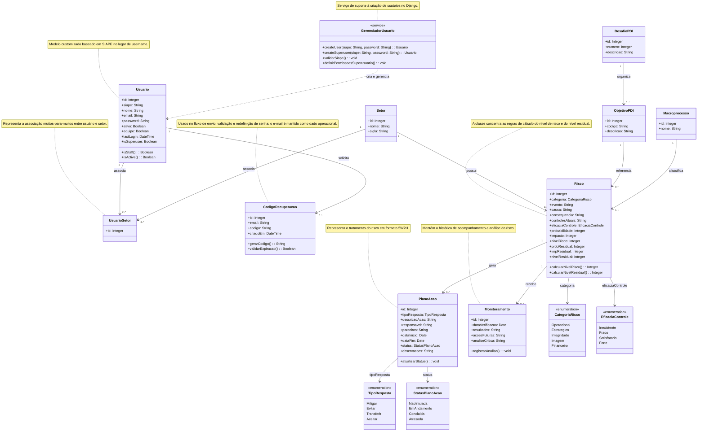

# Banco de dados

## Diagrama de classes (UML) - Mermaid

Utilizando a ferramenta Mermaid para representar as principais classes persistidas no banco de dados e seus relacionamentos.



## Diagrama entidade relacionamento (ER) (Padrão ISO/Min-max) - Dbdiagram.io

Utilizando a sintaxe do Dbdiagram.io para representar a estrutura relacional do banco com base nas tabelas atuais do projeto.


## Tecnologia utilizada

O sistema utiliza **PostgreSQL 16**, executado localmente por meio do Docker Compose.

## Configuração local

O container do banco é definido em `docker-compose.yml` com:

- banco: `gestao_risco_ufsm`;
- usuário: `postgres`;
- senha: `postgres`;
- porta externa: `5433`;
- porta interna do container: `5432`.

## Conexão usada pelo Django

O backend espera as seguintes variáveis no `.env`:

```env
DATABASE_NAME=gestao_risco_ufsm
DATABASE_USER=postgres
DATABASE_PASSWORD=postgres
DATABASE_HOST=localhost
DATABASE_PORT=5433
```

## Estrutura principal

As entidades mais relevantes do sistema incluem:

- `setores`
  - armazena as unidades administrativas vinculadas a usuários e riscos;
- `usuarios`
  - representa os gestores autenticados no sistema;
- `usuario_setores`
  - tabela intermediária para o relacionamento muitos-para-muitos entre gestores e setores;
- `codigos_recuperacao`
  - registra códigos temporários usados no fluxo de recuperação de senha;
- `desafios_pdi`, `objetivos_pdi` e `macroprocessos`
  - representam a estrutura estratégica utilizada como referência para os riscos;
- `riscos`
  - armazena os registros centrais do sistema e os níveis calculados;
- `planos_acao`
  - guarda as ações de tratamento associadas a cada risco;
- `monitoramentos`
  - mantém o histórico de acompanhamento dos riscos.
