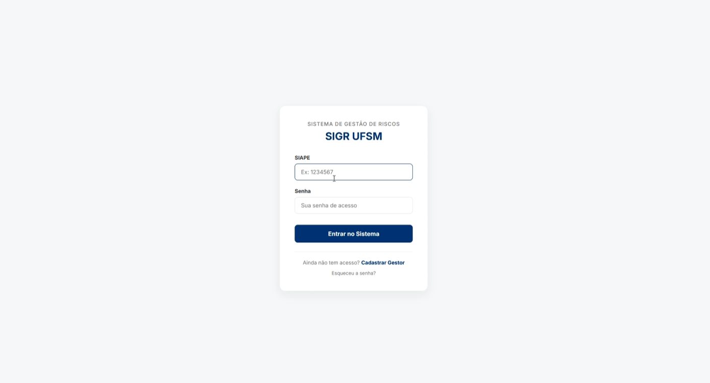
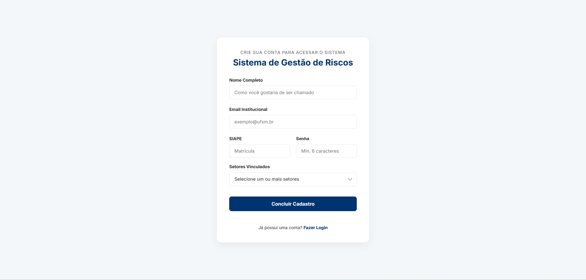
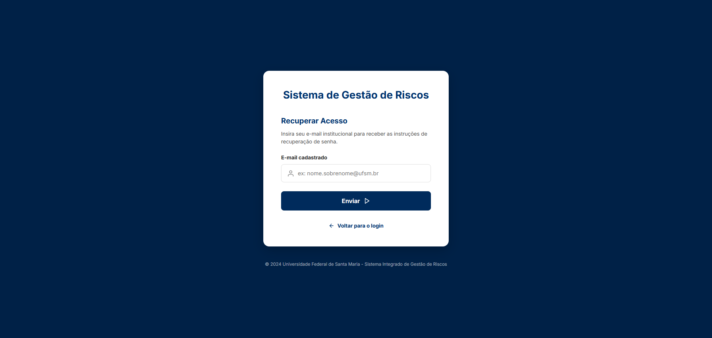
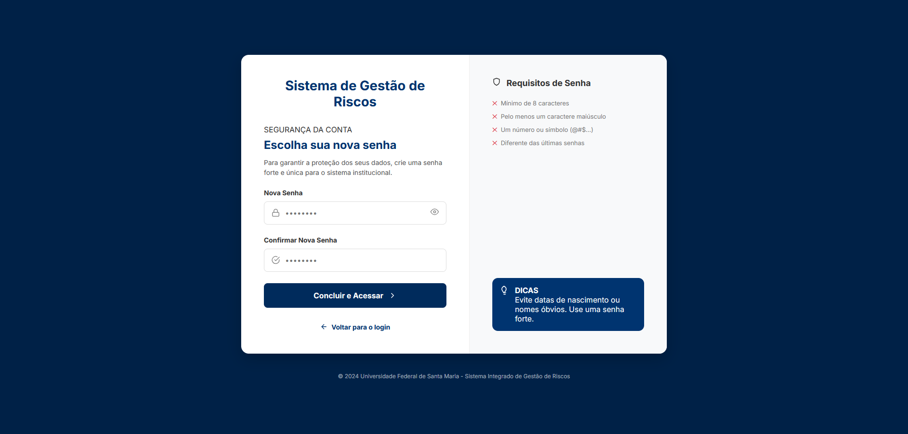
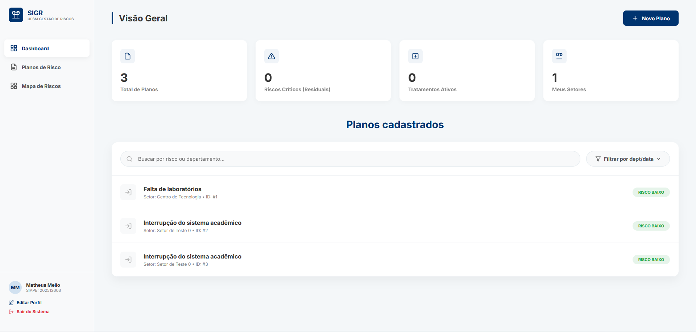
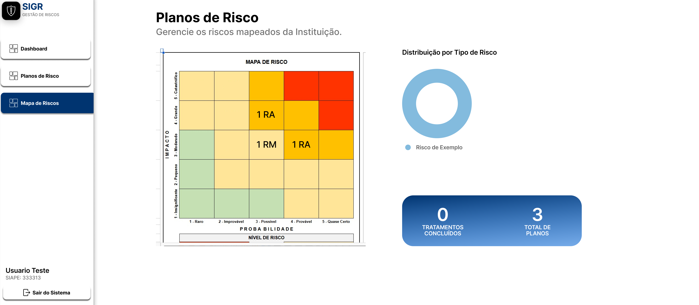
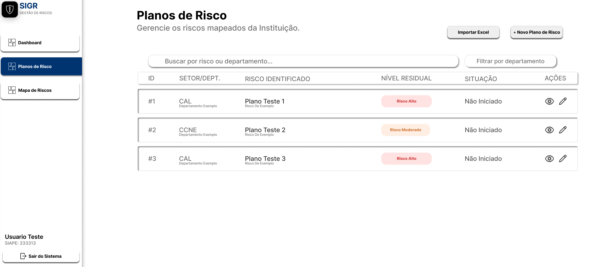

# Design e protótipo

## Visão geral

Esta página reúne as principais referências visuais do sistema, com foco nos fluxos de navegação mais importantes da aplicação. As imagens representam a proposta de interface utilizada como base para implementação e validação da experiência do usuário.

## Protótipo no Figma

O protótipo navegável pode ser consultado no Figma:

[Acessar protótipo no Figma](https://www.figma.com/site/TIMQ4NQpSF1VtQiYcKstQQ/Sistema-de-Gest%C3%A3o-de-Risco-Mirai-Tech?node-id=0-1&p=f&t=HC4BWr7ui4wVnasO-0)

## Organização das telas

As interfaces foram agrupadas por fluxo funcional para facilitar o entendimento do sistema:

- **Acesso ao sistema**: telas de login e cadastro;
- **Recuperação de credenciais**: fluxo de redefinição de senha por código;
- **Área autenticada**: dashboard e manutenção de perfil;
- **Gestão de riscos**: criação, visualização e acompanhamento dos planos de risco.

## Fluxo de autenticação

### Tela de login

Primeiro ponto de acesso do usuário ao sistema. A interface concentra a autenticação por SIAPE e senha.

### Tela de cadastro

Permite registrar novos usuários e associá-los aos setores disponíveis no sistema.

## Fluxo de recuperação de senha

### Etapa 1: informar e-mail

Início do processo de recuperação, no qual o usuário informa o e-mail cadastrado para receber o código de validação.

### Etapa 2: validar código

Tela intermediária destinada à conferência do código enviado para o e-mail do usuário.

### Etapa 3: definir nova senha

Etapa final do fluxo, onde a nova senha é cadastrada após a validação do código.

## Área principal do sistema

### Dashboard

Apresenta uma visão inicial do ambiente autenticado e serve como ponto de navegação para os módulos principais.

### Edição de perfil

Tela voltada à atualização de dados pessoais e credenciais do usuário autenticado.

## Gestão de planos de risco

### Criação de plano de risco

Interface destinada ao cadastro de um novo risco, com preenchimento das informações estratégicas e operacionais do plano.

### Mapa de risco

Visualização analítica para posicionamento e leitura dos riscos cadastrados conforme seus níveis e classificações.

### Visualização dos planos cadastrados

Tela de consulta dos planos já registrados, permitindo acompanhar e acessar os riscos existentes.

