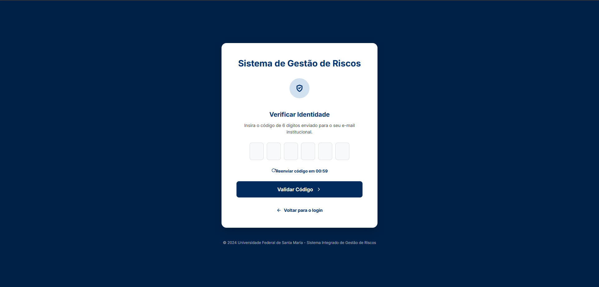
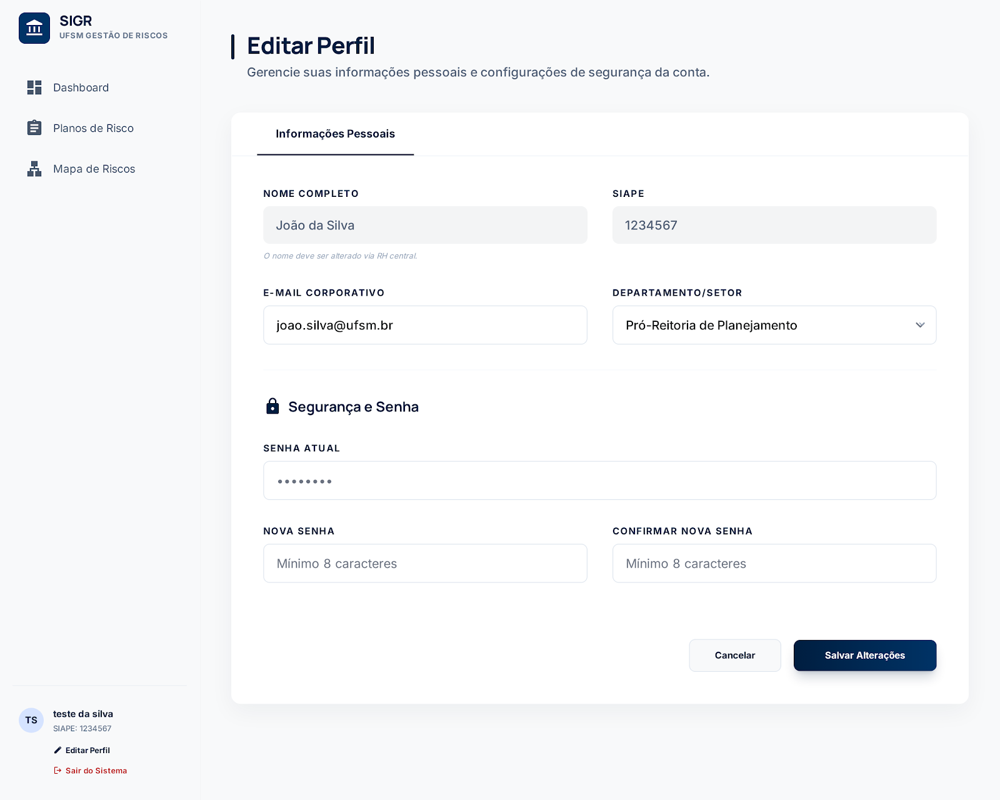
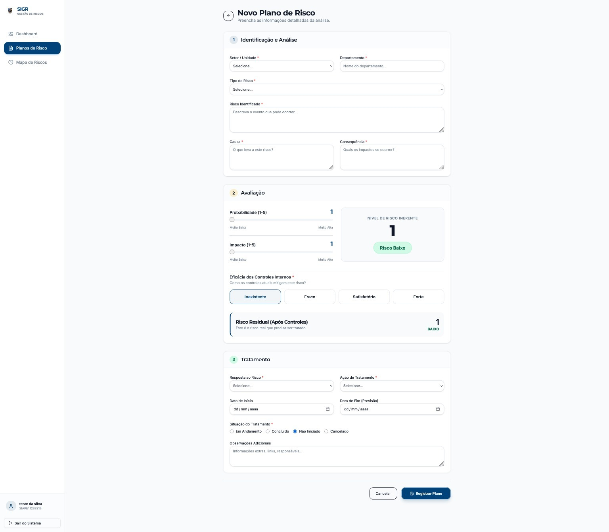

# Guia para o Design do Projeto

Este é um design provisório do projeto, sujeito a alterações, incluindo possíveis ajustes em algumas sidebars.

Link para o Figma:  
[Clique aqui](https://www.figma.com/site/TIMQ4NQpSF1VtQiYcKstQQ/Sistema-de-Gest%C3%A3o-de-Risco-Mirai-Tech?node-id=0-1&p=f&t=HC4BWr7ui4wVnasO-0)

---

## Autenticação

### Tela de Login

### Tela de Cadastro

---

## Recuperação de Senha

### Tela 1 - Digitar e-mail

### Tela 2 - Digitar código

### Tela 3 - Nova senha

---

## Dashboard Principal

### Dashboard

### Editar Perfil

---

## Gestão de Planos de Risco

### Criar Plano de Risco

### Mapa de Risco

### Visualizar Todos os Planos de Risco
